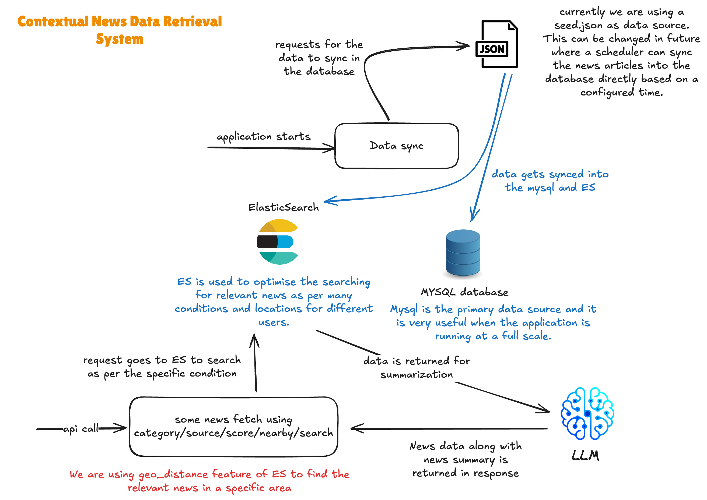

# Contextual News Data Retrieval System

This project sets up a **Contextual News Data Retrieval System** using **Node.js**, **MySQL**, and **Elasticsearch** in a **Dockerized** environment.

## Brief Architecture Diagram


## Project Structure
```sh
.
├── Dockerfile
├── README.md
├── docker-compose.yml
├── es_init.sh
├── es_mappings
│   └── news_mapping.json
├── init.sql
├── nodemon.json
├── package-lock.json
├── package.json
├── scripts
│   └── seed.json
├── src
│   ├── app.ts
│   ├── config
│   │   ├── constants.ts
│   │   └── db.ts
│   ├── controllers
│   │   └── v1
│   │       ├── MonitorController.ts
│   │       └── NewsController.ts
│   ├── decorators
│   │   ├── Controller.ts
│   │   └── Endpoint.ts
│   ├── models
│   │   └── News.ts
│   ├── repositories
│   │   └── NewsRepository.ts
│   ├── routes
│   │   └── index.ts
│   ├── server.ts
│   ├── services
│   │   ├── GeocodingService.ts
│   │   └── LLMService.ts
│   ├── swagger.ts
│   ├── swagger.yaml
│   └── utils
│       ├── logger.ts
│       └── seed.ts
└── tsconfig.json

13 directories, 28 files
```

## Prerequisites

- **Docker** and **Docker Compose** must be installed on your system.

## Setup & Run

1. **Clone the Repository**
```sh
   git clone https://github.com/vibhanshu2001/contextual-news-system.git
   cd contextual-news-system
```
2. **Start the Application**
```sh
   docker-compose up -d --build
```
- This will start MySQL, Elasticsearch, and the Node.js application.

- MySQL will initialize with the required database and tables.

- Elasticsearch will be configured with the correct mappings.
3. **Check Running Containers**
```sh
   docker ps
```
4. **Check Application Logs**
```sh
   docker logs node_app -f
```
5. **Access Swagger API Documentation**
- Open in Browser:
```sh
   http://localhost:2056/api-docs
```
- This will show the available API endpoints for the system.

## Database Configuration
- The database credentials are set inside the constant file instead of a .env file.

- Default MySQL Credentials:
```sh
    HOST: mysql
    USER: user
    PASSWORD: password
    DATABASE: news_db
```

## Elasticsearch Configuration
- Elasticsearch runs on:
```sh
    http://localhost:9200
```

## LLM Configuration
- We are using Google Gemini for the purpose of summarizing the news articles:
- Place your GOOGLE_API_KEY in .env file
```sh
    GOOGLE_API_KEY="your-google-api-key"
```

## Stopping the Containers
To stop all running containers:
```sh
    docker-compose down
```

This README.md explains how to run your application with Docker and includes links to Swagger API documentation. The swagger.json file defines the API documentation.